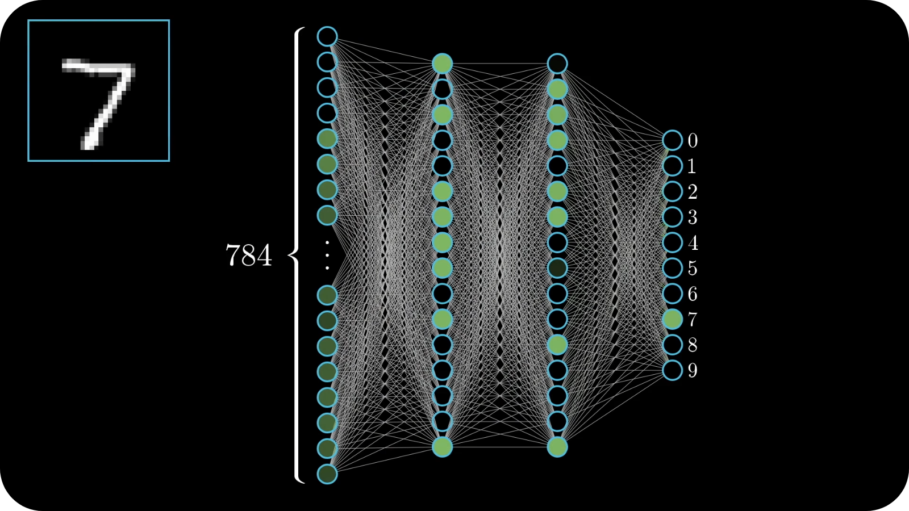

# 🤖 Neural Network


<br/>

This is a handmade neural network library for Python. It supports multiple layers, activation functions, optimizers... You can easily create a model and train it with backpropagation.

*(I made this project to show that I can make a neural network whithout any library, if you need a neural network library, [**Keras**](https://keras.io/) or [**PyTorch**](https://pytorch.org/) will be much better than this)*

<br/>

<p align="center">
	
</p>

<br/>

# 📋 Summary

* **[📋 Summary](#-summary)**
* **[✨ Features](#-features)**
* **[🛠️ Install](#%EF%B8%8F-install)**
* **[🧪 Tests](#-tests)**
* **[🙏 Credits](#-credits)**

<br/>

# ✨ Features

### Layers

* **Input Layer:** The input layer is the first layer of the network, it receives the input data

* **Linear:** A dense neural network layer, you can choose the number of neurons

* **Activation functions:** You can choose between **ReLU**, **Tanh** and **Softmax**

### Optimizers

They are used to update the weights of the network. You can choose between **SGD** and **Adam**.

### Loss functions

They are used to calculate the error of the network. You can choose between **Negative log likelihood**, **Mean squared error** and **Mean absolute error**.

<br/>

# 🛠️ Install

You need **Numpy** to install the library:
```shell
$ pip install numpy
```

Then, just put the **neural_network** folder in the root of your project.

Example of imports:
```python
from neural_network import Model
from neural_network.layers import Input, Linear, ReLU, Tanh, Softmax
from neural_network.optimizers import SGD, Adam
from neural_network.losses import NegativeLogLikelihood, MeanSquaredError, MeanAbsoluteError
```

<br/>

# 🧪 Tests

You can find a **jupyter notebook** in the **tests** folder, it contains a simple example of how to use the library by creating a model that classify handwritten digits.

<br/>

# 🙏 Credits

* [**Angel Uriot**](https://github.com/angeluriot) : Creator of the project.
